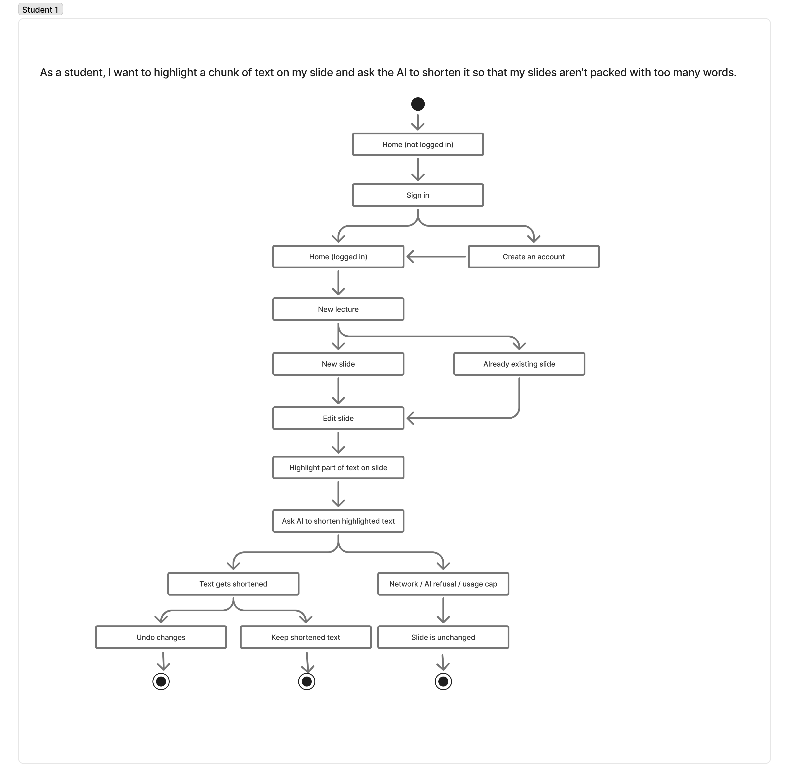
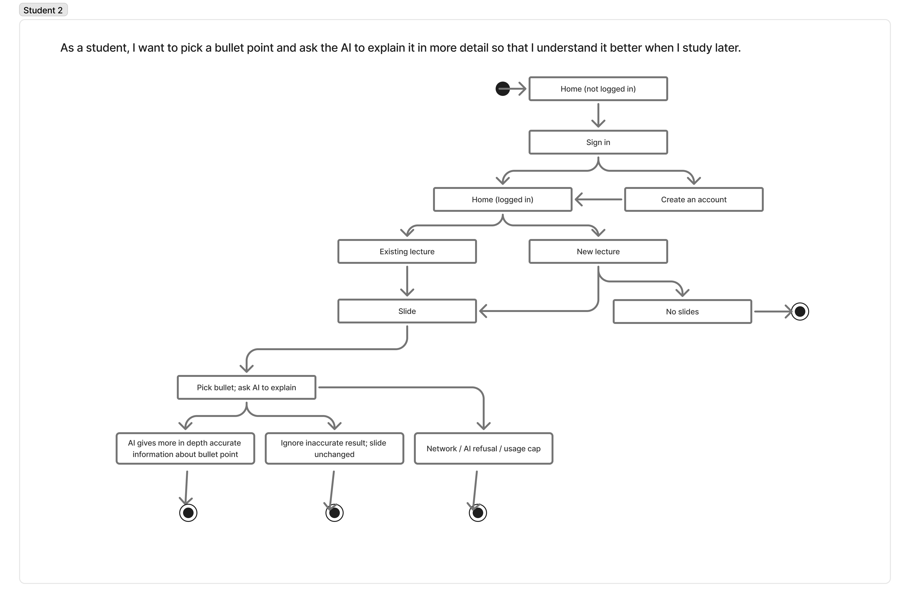
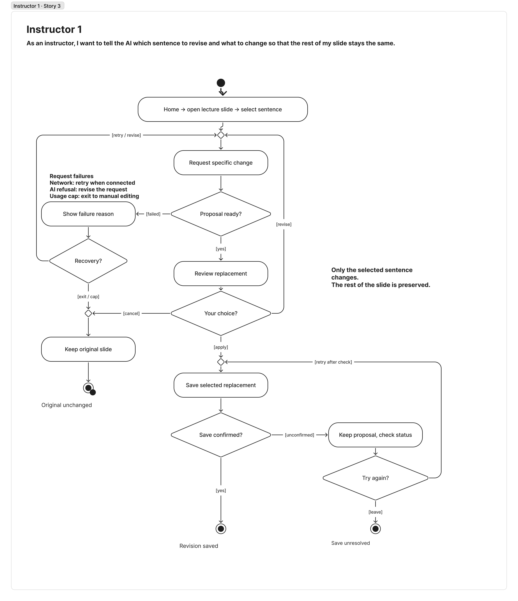
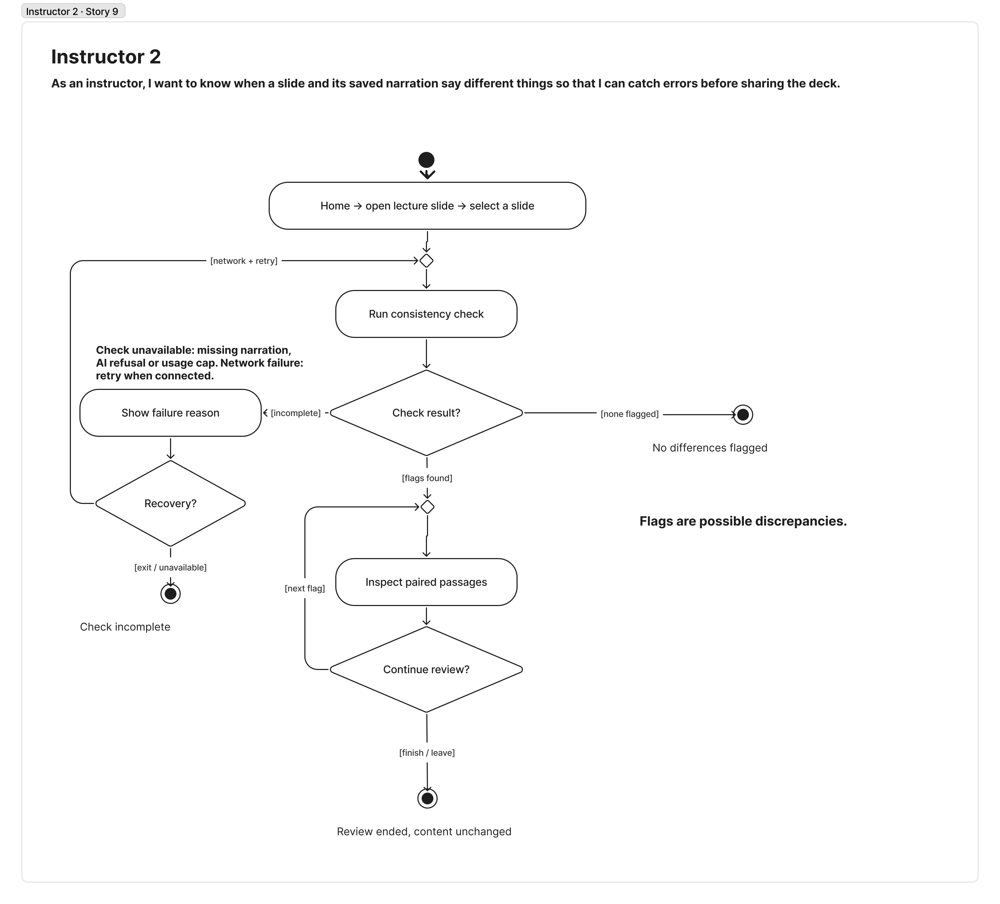

# Specification Phase Exercise

A little exercise to get started with the specification phase of the software development lifecycle. In this exercise, your team specifies a set of improvements and new features for [The Slide Machine](https://theslidemachine.com) — see the [instructions](instructions.md) for detail, and the [background](background.md) for an introduction to the software product you are tasked with extending.

## Team members

- [Ruihan Yang](https://github.com/rayyang262)
- [Hoang Ngo](https://github.com/ogngnaoh)
- [Jolie Leong](https://github.com/jl15113)
- [Sean Alliman](https://github.com/SeanA12)
- [Layan Alyas](https://github.com/layan-al)

## Review of the Current Application

1. **Strength — Generated slides organize lecture content clearly**  
   Slide Machine generally avoids placing too much information on a single slide and creates clear, relevant headings that correspond to the content being discussed.

2. **Strength — Speech is accurately translated into written slide content**  
   The application generally understands spoken lecture content accurately and can transform it into appropriate written forms, such as paragraphs or bullet points.

3. **Strength — The quiz generator creates relevant and well-distributed questions**  
   Generated quiz questions accurately reflect information presented in the lecture slides and distribute questions across distinct topics rather than concentrating heavily on one portion of the lecture.

4. **Strength — Exported slides preserve their presentation across supported formats**  
   Exported presentations closely match their appearance in Slide Machine, preserving the content, layout, and overall presentation.

5. **Weakness — Generated slides do not always include appropriate visual material**  
   Slide generation may omit useful images, diagrams, graphs, or other visual elements even when the lecture content could benefit from them.

6. **Weakness — Imported presentation designs are not reproduced consistently**  
   Importing designs from Google Slides or PowerPoint can alter elements of the original presentation, including fonts and design elements, and may result in inconsistent styling between slides.

7. **Weakness — Changing a generated slide's layout can cause existing content to display incorrectly**  
   When changing between certain slide layouts, existing text can become excessively large or extend beyond the available space, leaving portions of the content cut off.

8. **Weakness — AI refinement cannot reliably be reapplied after its changes are manually removed**  
   After using Refine with AI and manually deleting some or all of the generated changes, running the refinement feature again may produce no apparent changes.

9. **Weakness — Previously generated slide content is not consistently reorganized as a lecture develops**  
   As additional information is spoken, Slide Machine may continue adding information to the current or latest slide rather than reorganizing earlier content or beginning a new slide when the topic changes.

10. **Gap — Slide text has limited formatting and hierarchy controls**  
    The editor lacks several text-formatting capabilities, including changing fonts, adjusting indentation and bullet formatting, and creating multi-level bullet points for subtopics.

## Prior Art & Originality

Our team proposes improving Slide Machine through instructor-guided editing and AI revision. The goal is to give instructors more control over how AI-generated slide content is revised and reorganized after it has been generated.

We reviewed the project's existing roadmap, Future Work/Open Questions, open issues, and pull requests before developing this proposal. Some existing and planned features overlap with the general area of AI-assisted slide editing. For example, the roadmap includes post-lecture AI reformatting that can regenerate a lecture more holistically, as well as functionality for deciding whether newly generated content should update the current slide or create a new slide.

Our proposal differs by focusing on fine-grained, instructor-directed revision of generated content. Rather than only allowing the system to reorganize an entire lecture, an instructor could select specific content or slides and request actions such as condensing, expanding, splitting, combining, or reorganizing the selected material. The proposal would also explore allowing instructors to retry and compare AI refinements, restore previous versions, move generated content between slides, and organize information using additional hierarchical formatting controls such as multi-level bullet points and indentation.

Therefore, the original contribution of our proposal is not AI-based slide reformatting itself, but a more interactive revision workflow in which instructors can direct, compare, and control how the AI modifies specific portions of an existing presentation.

## Stakeholders

Payton B. 
(Student) Goals/Needs:
- Being able to re-listen to professor's presentation at own speed
- Have an accurate description of what was said in class
- Easy to read
- Emphasizes what the most important thing to focus on in class, so when reviewing notes or studying, can focus more on what was emphasized more in class
Problems/Frustrations:
- Does not pull a lot from the shared notes- just pulled the general language and embellished words
- Did not include a lot of information from the notes (e.g., grading policy from syllabus)
- Titles are a little janky - In course overview slides, “Who are you” should be the title (also what’s in notes)
- Did not like the variation in capitalization for the slides (mainly for bullet points) → unprofessional
- Did not like the lack of consistency for paragraphs and bullet points
- Makes it hard to read and follow
- There was more information and detail in the syllabus that was not included in the course overview slides
- Information is way clearer on the actual syllabus than the slides
- There was a title slide format for non-title text (three times on the course overview slides)
- Audio - really don’t like
- Doesn’t like that it recorded and altered voice
- Why does it change how she pronounced a name (correctly) but skip over a chunk of what she said
- Can't adjust speed (speed up or slow down)
- Can't adjust slide on (fast forward or rewind audio)
- Adding unnecessary stuff and skipping over important stuff
- Embellishing a lot of what was said
- Said a name wrong and didn’t catch all names
- Exit ticket: did not like the MCQ questions generated (not specific enough), multiple-answer questions (generated a question that was fine)
Positives (not part of project):
- Did pull the right names from the article provided
- Like that there are hyperlinks in the slides
- Liked variation of text effects for emphasis (bold, italics, etc.)

Ann L. (Student) Goals:
- Read out loud re-listen to the lecture
- AI Lecture summary generation things as a student should focus on
- Best way to learn is to teach: Make flashcards and quiz out of highlight
- Be able to annotate the slides
- Combine personal notes attach it to the slides using AI
Problem and frustration:
- Call to action is weird: From a student's perspective being a new user is hard to understand what to do on this site. Is the student supposed to make the new slides? Or go into already existing lecture slides.
- Have more features to edit the slides with: Rectangles, shapes, etc like Figma/ppt/google slides.
- Currently it's an unorganized way of making slides: If talking was supposed to be for convenience and save time but the problem is when users talk they usually are yapping without an order of context. It's better if the slides allowed making a skeleton outline first then adding in details to each slide based off the speech.
Positive:
- Have different languages to translate to
- Being able to annotate and can make a quiz
- Quiz is accurate

Instructor: T.N

Goals/Needs:

- Preserve the intended teaching content, including important explanations, examples and qualifications.
- Retain the purpose of instructional material: explanations should help students understand, and discussion questions should check their understanding.
- Maintain accurate and consistent terminology across generated slides and saved narration.
- Review and correct selected content efficiently while preserving material that is already accurate and useful.

Problems/Frustrations:

- Generated slides can summarize a lecture too aggressively, retaining facts while omitting explanations students need to understand them.
- Specific discussion questions can become broad summaries or learning objectives, weakening their usefulness for checking understanding.
- Generated material can include unrequested commentary or instructions, requiring the instructor to check whether the output still reflects the intended lesson.
- Errors can remain in saved narration even when the visible slides look correct, requiring separate checks of different versions of the same teaching material.

Positives:

- The app successfully incorporated a spoken correction into the generated slides.
- The visible slides preserved the main facts, names and numerical information in the test.
- It maintained an important distinction between factual evidence and the lecturer’s interpretation.
- The generated deck was readable and followed a sensible teaching sequence.
- The generated quiz broadly reflected the lecture content.

Instructor: Rouaa 
Goals/needs:
- Show students a diagram that explains the floor plan, rather than a merely related photo that doesn't represent the lesson content.
- Keep measurements, directions, room locations, and zoning terms accurate.
- Correct a specific part of a slide without disturbing content that is already right.
- Review AI changes and know whether a requested change happened before using the deck.
Problems/frustrations observed in our walkthrough:
- The app added an apartment photo where the lesson needed a floor-plan diagram.
- A search for a floor-plan diagram returned unhelpful results, and refining the slide did not reconsider the image already there.
- The slide-refinement controls did not let us say which sentence to change or how to change it.
- One text-refinement attempt made no visible change or explanation; another applied its changes directly without a preview.
Positives: 
- The tool turned our typed lesson transcript into a slide with a clear title and bullets.
- That generated slide kept the information we provided such as dimensions.
- The slide title and text could be edited manually if needed.
- The quiz preview reflected the lesson, though its questions were mostly factual recall.

## Product Vision Statement

The Slide Machine will help instructors create clear, accurate teaching materials and students turn those materials into effective study resources by giving both groups more control over AI-generated content and revisions.

## User Requirements

The stories selected for UML Activity Diagrams are shown in bold.

### Students

1. **As a student, I want to highlight a chunk of text on my slide and ask the AI to shorten it so that my slides aren't packed with too many words.**
2. **As a student, I want to pick a bullet point and ask the AI to explain it in more detail so that I understand it better when I study later.**
3. As a student, I want to split a slide that covers two topics into two slides so that each slide focuses on one idea.
4. As a student, I want to move a point from one slide to another so that information ends up under the right topic.
5. As a student, I want to attach my own class notes to a lecture slide so that I can study my notes alongside the professor's material.
6. As a student, I want to try an AI edit again and compare the versions so that I can keep the one that makes the most sense to me.
7. As a student, I want to undo an AI change and go back to what I had before so that I don't lose notes I already liked.
8. As a student, I want to add sub-bullets under a main point so that I can see which ideas are important and which are supporting details.
9. As a student, I want the AI to make capitalization and bullet style match across all my slides so that my notes look clean and are easy to read.
10. As a student, I want the AI to mark which points were emphasized most so that I know what to focus on when I review.

### Instructors

1. As an instructor, I want to specify that a slide needs a diagram rather than a photo so that the AI chooses a visual that explains the concept.
2. As an instructor, I want AI refinement to check an image already on my slide so that an irrelevant image can be replaced.
3. **As an instructor, I want to tell the AI which sentence to revise and what to change so that the rest of my slide stays the same.**
4. As an instructor, I want to review an AI-revised slide before the change is applied so that I can reject wording that misrepresents my lesson.
5. As an instructor, I want the app to tell me when an AI refinement makes no changes so that I know whether to try again or edit the slide myself.
6. As an instructor, I want to mark an explanation as essential so that the generated slide keeps the reasoning students need, not just the main fact.
7. As an instructor, I want a discussion question I ask to remain a question on the slide so that I can check students' understanding.
8. As an instructor, I want to see which statements the AI added on its own so that I can remove anything I didn't intend to teach.
9. **As an instructor, I want to know when a slide and its saved narration say different things so that I can catch errors before sharing the deck.**
10. As an instructor, I want to correct a term once across the slides and narration so that students see and hear consistent wording.

## Activity Diagrams

### Student — Story 1

As a student, I want to highlight a chunk of text on my slide and ask the AI to shorten it so that my slides aren't packed with too many words.

### Student — Story 2

As a student, I want to pick a bullet point and ask the AI to explain it in more detail so that I understand it better when I study later.

### Instructor — Story 3

As an instructor, I want to tell the AI which sentence to revise and what to change so that the rest of my slide stays the same.

### Instructor — Story 9

As an instructor, I want to know when a slide and its saved narration say different things so that I can catch errors before sharing the deck.

## Wireframes

[See instructions. Delete this line and place your wireframe diagrams here, covering every new screen and every existing screen your proposal changes, for every type of user.](https://www.figma.com/design/TpEbFM340iRNzZ9WJr2kjF/Wireframe-TSM?node-id=0-1&t=TpEamXDSFpVVLNPB-1)

## Clickable Prototype

https://www.figma.com/proto/TpEbFM340iRNzZ9WJr2kjF/Wireframe-TSM?node-id=0-1&t=TpEamXDSFpVVLNPB-1

## Stakeholder Demo

See instructions. Delete this line and place a link to the deck The Slide Machine generated during your presentation here, after you have presented.

## Exit Ticket

See instructions. Delete this line and place a link to the exit-ticket quiz you generated from your demo deck and distributed to the class, along with a short note on what — if anything — you had to correct in the generated questions before publishing.
